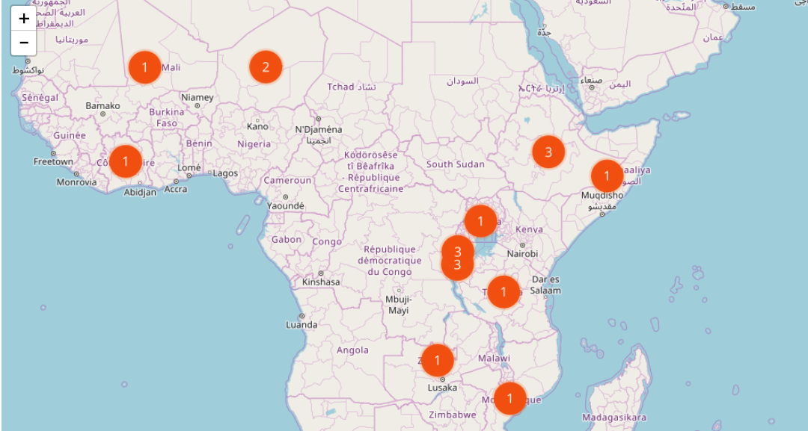

# CARE data layer

This software should run periodically in oder to generate a csv file for the production of a story layer, and automatically upload it to the careusa carto account.


## Requirements

You will need Python >3.5.
We recommend the [Anaconda Python distribution](https://anaconda.org/anaconda/python) for all platforms.

## Installation (native Python)

Once Python is installed you will need the project libraries, to install them, open this folder on the command line.
Once there execute the following:

```
pip install -r requirements.txt
```


You will also need a `.env` file with API credentials for Contentful in the same directory. The file contents should be:
```
SPACE_ID=XXXXXX
ACESS_TOKEN=XXXXXX
CARTO_API_KEY =XXXXXXX
```
The SPACE_ID and ACESS_TOKEN keys can be obtained from [Contentful](https://app.contentful.com/spaces/nlip0spjj3b7/api/keys/0x476IPThWIVAOF2zg7PoW).
The CARTO_API_KEY can be obtained from within the Carto account.
These keys can also be obtained by contacting the Vizzuality development team.

## Running

If your Python is set up, and you have installed the requirements file, you can execute the python script natively via:

```
python carto_layer.py
```

A sucessful run will result in the following output, and the table being updated:
```
╰─$ python carto_layer.py
Found  44 stories.

Created temporary file
Carto respose 200: Table upload successful
Cleanup stage - removing temporary file.
```


### Generating a Carto Map layer from this table

You can generate a Carto map layer from these data as follows:

e.g. In Python using Foilum:

```python
import folium
import requests
import json


possible_tags_to_select = ['climate_change',
                                 'economic_development',
                                 'education',
                                 'emergency__disaster_aid',
                                 'food_security',
                                 'grand_prize',
                                 'health',
                                 'water',
                                 'total']


year = 2016
var_to_view = 'total'  # <-- E.g. of selecting a variable for the layer
tag = 'education'

query=(f"WITH data AS "
       f"(SELECT iso, COUNT(year) as value FROM output_stories "
       f"WHERE year = {year} "
      # f"AND {tag} = true "
       f"GROUP BY iso) "
       f"SELECT map.iso, map.cartodb_id, ST_CENTROID(map.the_geom_webmercator) AS the_geom_webmercator, "
       f"data.value as value "
       f"from world_complete_1 AS map "
       f"INNER JOIN data "
       f"ON data.iso = map.iso")
print(query)

style = ("#test_stories{"
           "marker-fill-opacity: 1.0;"
           "marker-line-color: #f46508;"
           "marker-line-width: 5;"
           "marker-line-opacity: 0.2;"
           "marker-placement: point;"
           "marker-type: ellipse;"
           "marker-width: 40;"
           "marker-fill: #F25A0D;"
           "marker-allow-overlap: true;}"
        " #test_stories::labels {"
           "text-name: [value];"
           "text-face-name: 'Open Sans Regular';"
           "text-size: 16;"
           "text-label-position-tolerance: 10;"
           "text-fill: #FFFFFF;"
           "text-dy: 0;"
           "text-allow-overlap: true;"
           "text-placement: point;"
           "text-placement-type: simple;}"
        )
account = 'careusa'
urlCarto = 'https://'+account+'.carto.com/api/v1/map'
body = {
    "layers": [{
        "type": "cartodb",
        "options": {
            "sql": query,
            "cartocss":style,
            "cartocss_version": "2.1.1"
        }
    }]
}

r = requests.post(urlCarto, data=json.dumps(body), headers={'content-type': 'application/json; charset=UTF-8'})
print(r.url)
#pprint.pprint(r.json())

tileUrl = 'https://'+account+'.carto.com/api/v1/map/' + r.json()['layergroupid'] + '/{z}/{x}/{y}.png32';

map_osm = folium.Map(location=[45.5236, 0.6750], zoom_start=3, tiles='OpenStreetMap', attr='random')
folium.TileLayer(
    tiles=tileUrl,
    attr='text',
    name='text',
    overlay=True
).add_to(map_osm)

map_osm

```


