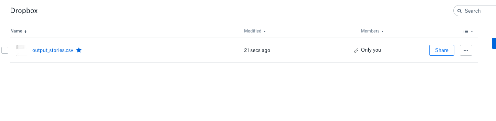
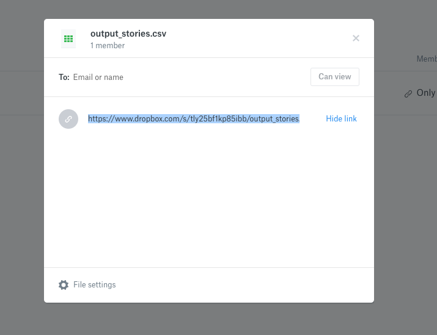
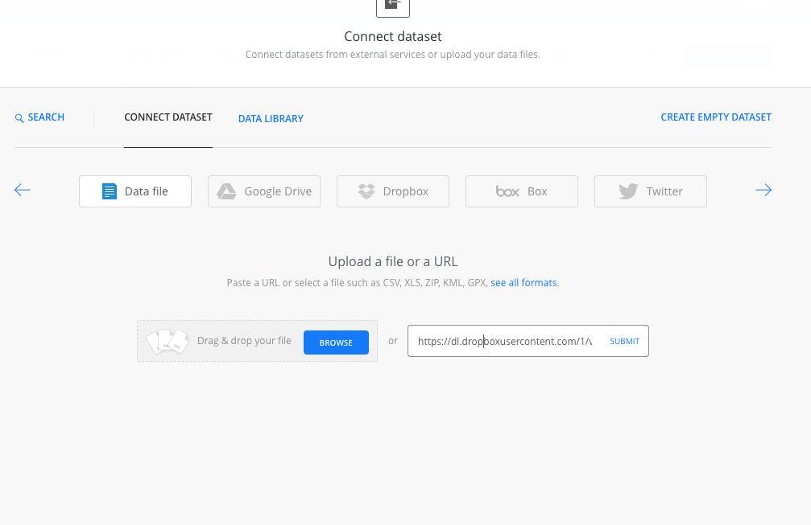
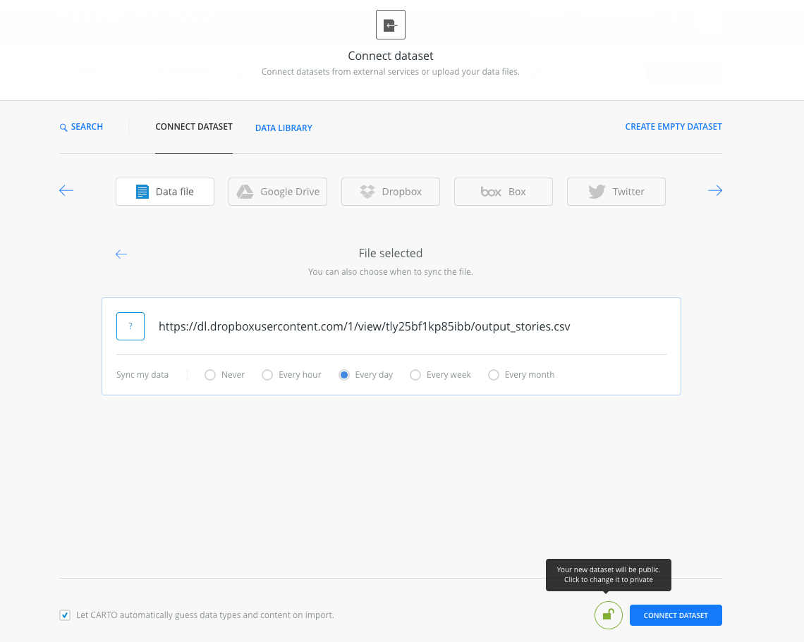

# CARE data layer

This software should run periodically in oder to generate a csv file for the production of a story layer.


## Requirements

You will need Python >3.5.
We recommend the [Anaconda Python distribution](https://anaconda.org/anaconda/python) for all platforms.

## Installation (native Python)

Once Python is installed you will need the project libraries, to install them, open this folder on the command line.
Once there execute the following:

```
pip install -r requirements.txt
```


You will also need a `.env` file with API credentials for Contentful in the same directory. The file contents should be:
```
SPACE_ID=XXXXXX
ACESS_TOKEN=XXXXXX

```
These keys can be obtained from [Contentful](https://app.contentful.com/spaces/nlip0spjj3b7/api/keys/0x476IPThWIVAOF2zg7PoW).

## Running

If your Python is set up, and you have installed the requirements file, you can execute the python script natively via:

```
python carto_layer.py
```


## Syncing the output file to Dropbox

After running, the script should produce an output file: `output_stores.csv` in your local directory. We will need to place this in a location in sync with the Care Carto account (`https://careusa.carto.com`).

We have set up a dropbox account:

  - username: `benjamin.laken@vizzuality.com`
  - password: XXXX (shared on LastPass)

The procedure is to run the python software, and take the `output_stories.csv` file and upload that to the dropbox account, overwriting/replacing the existing file.

Once the file is overwritten, the shared link should be enough to access the file.




This link should stay as:
'https://www.dropbox.com/s/tly25bf1kp85ibb/output_stories.csv?dl=0'

note, to access the file directly from this link, you will need to view the following URL:

`https://dl.dropboxusercontent.com/1/view/tly25bf1kp85ibb/output_stories.csv`

It is the latter URL that should be connected to Carto. This should already be done.
The file should be set to sync once every day (or whatever your preferred update rate is).
The table should be `output_stories` in the `careusa` Carto account.





### Generating a Carto Map layer

You can generate a Carto map layer from these data as follows:

e.g. In Python using Foilum:

```python
import folium
import requests
import json


possible_variables_to_select = ['climate_change',
                                 'economic_development',
                                 'education',
                                 'emergency_&_disaster_aid',
                                 'food_security',
                                 'grand_prize',
                                 'health',
                                 'water',
                                 'total']


var_to_view = 'total'  # <-- E.g. of selecting a variable for the layer

query=(f"WITH data AS "
       f"(SELECT * FROM output_stories) "
       f"SELECT map.iso, map.cartodb_id, ST_CENTROID(map.the_geom_webmercator) AS the_geom_webmercator, "
       f"data.{var_to_view} as value, data.name "
       f"from world_complete_1 AS map "
       f"INNER JOIN data "
       f"ON data.iso = map.iso")
print(query)

style = ("#test_stories{"
          "marker-fill-opacity: 1.0;"
          "marker-line-color: #EFC8B2;"
          "marker-line-width: 5;"
          "marker-line-opacity: 1.0;"
          "marker-placement: point;"
          "marker-type: ellipse;"
          "marker-width: 40;"
          "marker-fill: #F25A0D;"
          "marker-allow-overlap: true; }"

        "#test_stories::labels {"
         " text-name: [value];"
        "  text-face-name: 'DejaVu Sans Book';"
        "  text-size: 10;"
        "  text-label-position-tolerance: 10;"
        "  text-fill: #000;"
        "  text-halo-fill: #FFF;"
        "  text-halo-radius: 1;"
        "  text-dy: 0;"
        "  text-allow-overlap: true;"
        "  text-placement: point;"
        "  text-placement-type: simple;}"
        )
account = 'careusa'
urlCarto = 'https://'+account+'.carto.com/api/v1/map'
body = {
    "layers": [{
        "type": "cartodb",
        "options": {
            "sql": query,
            "cartocss":style,
            "cartocss_version": "2.1.1"
        }
    }]
}

r = requests.post(urlCarto, data=json.dumps(body), headers={'content-type': 'application/json; charset=UTF-8'})
print(r.url)
#pprint.pprint(r.json())

tileUrl = 'https://'+account+'.carto.com/api/v1/map/' + r.json()['layergroupid'] + '/{z}/{x}/{y}.png32';

map_osm = folium.Map(location=[45.5236, 0.6750], zoom_start=3, tiles='OpenStreetMap', attr='random')
folium.TileLayer(
    tiles=tileUrl,
    attr='text',
    name='text',
    overlay=True
).add_to(map_osm)

map_osm

```


